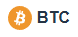
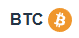

## Install package

```bash
yarn add @mui/icons-material @mui/material @emotion/styled @emotion/react crypto-token-icon
```

## Using nomal

```tsx
import { IconHT, IconHTX } from 'crypto-token-icon';

function App() {
    return (
        <>
            <IconHT />
            <IconHTX />
        </>
    );
}
```

## Incase unknow token name

```tsx
import { Icon } from 'crypto-token-icon';

function App() {
    return (
        <>
            <Icon tokenName={'BTC'} sx={{ fontSize: '40px' }} />
            <Icon tokenName={'other string' as any} sx={{ fontSize: '40px' }} />
        </>
    );
}
```

## Some useful type and data support

```tsx
import { TokenName } from 'crypto-token-icon';

const x: TokenName = TokenName.BTC;
```

```tsx
import { mapNameToIcon, SvgComponent } from 'crypto-token-icon';

const x: SvgComponent = mapNameToIcon['BTC'];
```

```tsx
import { WalletName } from 'crypto-token-icon';

WalletName.metaMask;
```

```tsx
import { IconAndName } from 'crypto-token-icon'

<IconAndName tokenName={TokenName.BTC} />
<IconAndName tokenName={TokenName.BTC} reverse={true} />
```





## Prepare when dev package

prepare for vite:

```bash
yarn add @types/node vite-plugin-dts
```
